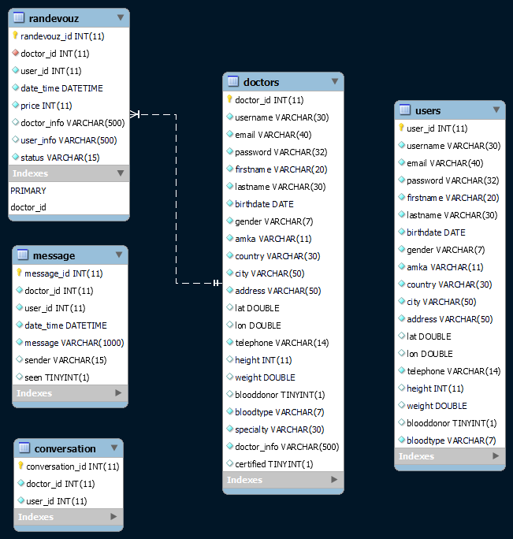

<h2 align="center">HY-359 Project</h2>
<h3 align="center">Personalized Health</h3>
  

    <a href="https://hy359-personal-health.herokuapp.com/"><strong>Go to site »</strong></a>
     
    <a href="https://github.com/joeFelek/Hy359PersonalHealth"><strong>Explore the docs »</strong></a>
     
    Iosif Felekidis
    ·
    4062
    ·
    2021-2022
  

<!-- TABLE OF CONTENTS -->

  
Table of Contents

  <ol>
    <li>
      <a href="#about-the-project">About The Project</a>
      <ul>
        <li><a href="#built-with">Built With</a></li>
      </ul>
    </li>
    <li>
      <a href="#details">Details</a>
      <ul>
        <li><a href="#tasks">Tasks</a></li>
        <li> <a href="#implementation">Implementation</a>
            <ol>
                <li> <a href="#database">Database</a> </li>            
                <li> <a href="#java">Java</a> 
                    <ul>
                        <li><a href="#dao">DAO</a></li>
                        <li><a href="#database-manipulation">Database Manipulation</a></li>
                        <li><a href="#session-tracking">Session Tracking</a></li>
                        <li><a href="#servlets">Servlets</a></li>
                        <li><a href="#jsp">JSP</a></li>
                        <li><a href="#security">Security</a></li>
                    </ul>
                </li>
                <li> <a href="#front-end">Front End</a> 
                    <ul>
                        <li><a href="#index">Index</a></li>
                        <li><a href="#datatables">DataTables</a></li>
                        <li><a href="#css-files">Css Files</a></li>
                        <li><a href="#html-files">Html Files</a></li>
                        <li><a href="#js-files">Js Files</a></li>
                    </ul>
                </li>
            </ol>
        </li>
      </ul>
    </li>
    <li> <a href="#usage">Usage</a> </li>
  </ol>

<!-- ABOUT THE PROJECT -->

## About The Project

For some stupid reason I decided to do a two-man project alone ¯\_(ツ)_/¯. This is what I managed to create.

Personalized Health is a maven structured java webapp. Its purpose is to give the client and doctor a way of
communication with appointment booking and real-time chatting.

If you want to check out the webapp I deployed it in heroku [Personalized Health](https://hy359-personal-health.herokuapp.com/)(Current site status is Up!!✅) 

You are free to modify anything you want. Here are some already registered users:
* Normal User: 
    * ___username___: mountanton 
    * ___password___: 123456
* Doctors: 
    * ___username___: papadakis 
    * ___password___: doctor12*
    
     
    
    * ___username___: stefanos 
    * ___password___: abcd12$3

(<a href="#top">back to top</a>)

### Built With

Front End:

* [Bootstrap-4.6.0](https://getbootstrap.com/)
* [JQuery-3.5.1](https://jquery.com)
* [DataTables](https://datatables.net/)
* [FontAwesome-4.7](https://fontawesome.com/)

Back End:

* [MySQL-8](https://www.mysql.com/)

Web Hosting:

* [Heroku](https://www.heroku.com/)
* [JawsDB](https://www.jawsdb.com/)

(<a href="#top">back to top</a>)

# Details

The main functionalities implemented are:

* User registration
* Find Doctor near me
* Rendezvous handling for both user and doctor
* Message sending

## Tasks

**Based on the project tasks, for each type of user:**

* For Visitor:
    * 2/2 tasks:
        * Find doctor without near me sorting.
        * General info in footer.

* For Admin:
    * 3/3 tasks:
        * Login.
        * See clients and doctors and be able to delete them.
        * Certify doctors.

* For Clients:
    * 4/6 tasks done:
        * Register, Login, see his fitness health and see/edit his details.
        * Find doctors near me and sort them based on distance or duration or price.
        * Book appointment and notify or get notified on cancel.
        * Message to/from doctor when at least one appointment was done.
    * tasks undone:
        * Exam register.
        * Compare treatment and exam.

* For Doctors:
    * 3/5 tasks done:
        * Register, Login, see his fitness health and see/edit his details.
        * Rendezvous handling. See, create, cancel, mark as done.
        * Message to/from user when at least one appointment was done.
    * tasks undone:
        * See user's examination history
        * New treatment

* Extra functionalities:
    * Send notifications to user when he has unread messages.
    * Medical APIs in footer for all users:
        * COVID-19 stats today in Greece.
        * Medical news (with Google search API).

## Implementation

### Database

    

* User, Doctor
    * no changes
* Rendezvous
    * changed `date_time` to type `DATETIME`
* Message
    * removed foreign key constraint for `doctor_id` and `user_id`
    * added new col `seen TINYINT`, tracks if message has been seen or not.
* Conversation
    * new table
    * usage: keep track which users have talked to each other.

### Java

#### DAO

* User
* Doctor
* SimpleUser
* Randevouz
* Message
    * added new variable `int seen`:
* Conversation
    * new model for conversation table.

#### Database Manipulation

Done with classes `Edit<tableName>Table`. They implement getters and setters for database elements, run queries ect.

#### Session Tracking

Done with HTTPSession API with two variables `loggedIn`=`"username"` and `userType`=`"doctor"` or `"user"` or `"admin"`.
 
_I know it's not the safest way to do it, but it makes life easy_ 🙂

#### Servlets

There are 23 total servlets in the webapp each of them handles a GET or POST request. They are called with AJAX and
always receive json formatted data if they handle POST. Their main objective is to create, update or return data from
the database to the client using database manipulation classes and formatting the results as needed. Some of
them `DoctorListForUser`
do HttpOK request to APIs. Their functionalities are pretty straightforward by their names and the javascript functions
that call them have the same names. In more detail:

1. `AdminCertify`: Admin Certify Doctor.
2. `AdminDelete`: Admin Delete User.
3. `BookRendezvous`: User mark rendezvous as selected, Send message to doctor that a user selected a rendezvous.
4. `CancelRendezvous`: Invoked by User or Doctor, User marks rendezvous as free and removes user_info and user_id from
   Rendezvous table. Doctor Deletes rendezvous from Rendezvous table. Sends message to the other doctor or user
   notifying them that the rendezvous has been canceled.
5. `CheckAvailability`: Checks if username, email and AMKA values are already in use.
6. `DoctorListForUser`: Returns the json info of all certified doctors plus their distance and duration from the current
   user.
7. `DoctorRendezvous`: Returns all rendezvous of the current doctor and removes rendezvous that have status equal to
   free and are expired (datetime < now).
8. `DoctorList`: return all certified Doctors.
9. `DoneRendezvous`: Set Rendezvous status to done.
10. `isLogged`: Check session attributes to see if user is already logged in.
11. `Login`: Check user credentials (username, password). If credentials are incorrect return with status code 401. If
    credentials are correct but doctor is not certified return with status code 403. If credentials are correct set
    session attributes username and userType and return json (username, userType, success message).
12. `Logout`: Invalidate session.
13. `MessageSeen`: Mark messages as seen, set Message table seen to 1.
14. `NewRendezvous`: Create new rendezvous, status will be set to free, user_id to 0, user_info to 'null'.
15. `SendMessage`: Create new Message row in table.
16. `ShowAvailableDoctors`: return all certified Doctors.
17. `ShowAvailableRendezvous`: return all rendezvous with status free for only one specific doctor.
18. `StartConversation`: Create new Conversation row and send a hello message to receiver.
19. `Submit`: Submit signup form, Create new client or doctor.
20. `Update`: Update doctor's or user's info.
21. `updateInit`: returns all doctor's or user's info in json format.
22. `UpdateNotifications`: returns the number of unread messages for the current doctor or user.
23. `UserListRendezvous`: return all rendezvous of the current user in json format.

#### JSP

There are 5 jsp files and most of them, 3 out 5, are just a setup for [dataTables](#DataTables) so they don't have any
java code, I know such a waste, but since I discovered dataTables it was so much easier to let it fill the table
automatically. `Messages.jsp` java code sets up the chatting between users and `adminUserTable.jsp` dynamically creates
the tables for the admin.

#### Security

_none! <q>Everything is permitted, Nothing is true.</q>_ ***t(-_-t)***

### Front End

#### Index

`Index.html` has a nav, a main container that is empty and a footer.
 
The nav contains a list of buttons, on the left there are user based action buttons and on the right account buttons,
that are the same between doctor/client.  

Nav Buttons:

* Left nav
    * For users:
        * `Doctors`: load to main container all certified doctors sorted by distance or duration.
        * `Rendezvous`: load to main container user's rendezvous.
    * For doctors:
        * `Rendezvous`: load to main container doctor's rendezvous.
    * For visitors:
        * `Doctors`: load to main container all certified doctors.
* Right nav
    * For users and doctors:
        * `user`: show user details and fitness.
        * `bell`: show notification modal window.
        * `log out`
    * For visitors:
        * `login`
        * `sign in`

For admin only a logout button.

All html and jsp files are loaded inside the main container (except `signup.html`).

The Footer contains 4 cols, the first has today's Covid-19 stats, the second some links, the third loads the top 3
medical news in Greece from Google and the final contains some random contact info.

#### DataTables

DataTables is a tool that styles, adds many functions like search and sorting and fills tables automatically from ajax
request. It does an ajax request and fills the tables rows based the json response from the servlet. I only had to specify
the servlet it calls. Most of the data in this app is shown in tables and DataTables makes it so easy 💘.

#### Css

* `home.css`: for everything 🙂
* `style.css`: for signup form

#### Html

* `signup.html`: signup form
* `login.html`: login form
* `user_details.html`: fitness and user details form

#### Js

* `script.js`: main script for `signup.html`, handles user registration actions
* `checkSubmit.js`: script for `signup.html`, checks for duplicates while user signs in.
* `map.js`: script for `signup.html`, handles map API.
* `home.js`: main script for `index.html` handles nav and footer actions.
* `userListDoctors.js`: script for `userListDoctors.jsp`.
* `userRendezvous.js`: script for `userRendezvous.jsp`.
* `doctorRendezvous.js`: script for `doctorRendezvous.jsp`.

## Usage

_Actions_

* Life for a visitor:
    * `nav:`
        * `Doctors`: show all certified doctors.
        * `Log in`: show login form.
            * `LOG IN`: log to system, the nav buttons change based on user type.
        * `Sign up`: sends you to register form.

* Life for a doctor:
    * `nav:`
        * `Rendezvous`: show all your rendezvous.
            * `New`: create new rendezvous. A form will pop up.
                * `Create`: fill the form to create a status free rendezvous with the specified details.
            * `Done`: set the selected rendezvous as done, free status rendezvous excluded.
            * `Cancel`: cancel the selected rendezvous, done status rendezvous excluded.
            * `Export`: export all rendezvous selected to PDF, if none are selected export all. If you want to filter
              them you can use the search bar.

* Life for a user:
    * `nav`:
        * `Doctors`: show all certified doctors and sort them based on their distance from your location.
            * `Book Rendezvous`: show all available rendezvous for the selected doctor.
                * `on rendezvous select`: show a text area to write extra comments for the doctor.
                    * `Book`: book rendezvous. After few seconds the popup window will close automatically.
        * `Rendezvous`: show all your rendezvous
            * `Send message`: If the rendezvous is done, send message to doctor.
            * `Cancel`: cancel the selected rendezvous, done status rendezvous excluded.

* Shared user and doctor actions:
    * `Profile`: show all your details and fitness health.
        * `Update`: if any changes were made to the form fields change info
    * `Bell`: show notifications pop up, if any new notifications bell will be red.
        * `See all`: show all your conversations, if a conversation has an unread message it will change style.
            * `on conversation select`: show all messages, every conversation has a chat except the one with System.
    * `Log Out`: log out of the system.

(<a href="#top">back to top</a>)

